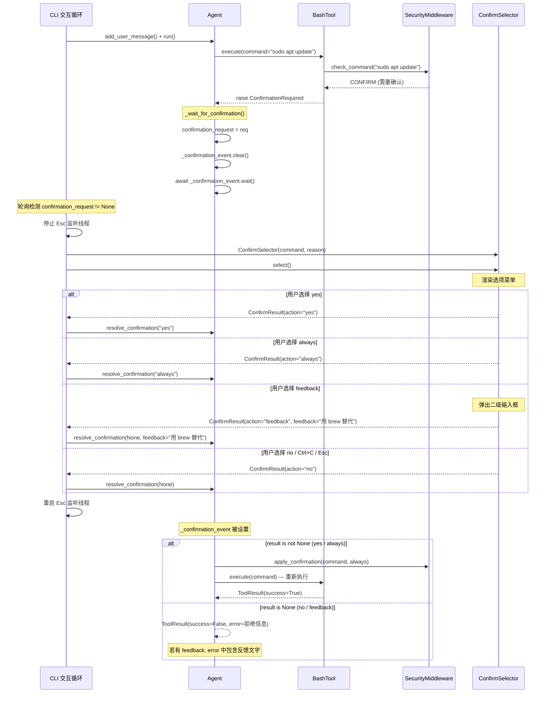

# 交互式确认选择器（ConfirmSelector）特性设计文档

> 日期：2026-06-13
> 作者：[自动生成]
> 状态：已实现

---

## 1. 概述

### 1.1 背景

在安全中间件（Security Middleware）实现之后，当 BashTool 或文件工具检测到危险操作时，会抛出 `ConfirmationRequired` 异常暂停执行，等待用户确认。最初的确认流程使用 `prompt_toolkit.PromptSession` 的文本输入方式，让用户手动键入 `y`、`n` 或 `a`。这种纯文本交互存在以下问题：

1. **可发现性差** — 用户需要阅读提示文字才能知道有哪些选项，容易忽略快捷键
2. **无法提供反馈** — 用户只能简单接受或拒绝，无法告诉 LLM "请用其他方式替代"或"不要用 sudo"
3. **视觉反馈弱** — 文本提示无法突出显示当前焦点选项，操作体验生硬
4. **stdin 竞争** — Esc 监听线程占用 stdin，与 `prompt_async` 冲突，需要先停止再重启

### 1.2 目标

- 用交互式上下键选择菜单替代纯文本确认提示
- 新增 "反馈" 选项，允许用户输入自由文本引导 LLM 修改行为
- 通过 `prompt_toolkit.Application` 构建全屏终端 UI，提供视觉焦点高亮
- 保持与现有 Agent 确认流程的无缝集成

### 1.3 非目标

- 不改变安全分类逻辑（DENY/CONFIRM/SAFE 三级分类不变）
- 不改变规则持久化机制（`always` 选项仍然写入 `security_rules.json`）
- 不支持多级菜单嵌套（反馈输入是单层二级提示）

---

## 2. 设计方案

### 2.1 总体架构

ConfirmSelector 位于 CLI 层与 Agent 确认流程之间，作为 UI 组件独立于业务逻辑：

```
┌──────────────────────────────────────────────────────────┐
│  CLI (cli.py) — 交互循环                                  │
│                                                          │
│   ┌────────────────────────────────────────────────┐     │
│   │  Agent 执行循环                                  │     │
│   │     │                                           │     │
│   │     ▼ BashTool.execute() → ConfirmationRequired │     │
│   │     │                                           │     │
│   │     ▼ _wait_for_confirmation() — 暂停           │     │
│   └────────────────────────────────────────────────┘     │
│          │                                               │
│          │ agent.confirmation_request != None             │
│          ▼                                               │
│   ┌──────────────────────┐                               │
│   │  ConfirmSelector      │  ← 新增 UI 组件              │
│   │  (上下键选择 + 反馈)   │                               │
│   └──────────┬───────────┘                               │
│              │ ConfirmResult                               │
│              ▼                                            │
│   agent.resolve_confirmation(result, feedback)            │
│          │                                               │
│          ▼ _confirmation_event.set() → Agent 恢复执行      │
└──────────────────────────────────────────────────────────┘
```

### 2.2 核心组件

#### ConfirmResult 数据模型

定义在 `mini_agent/ui/confirm_selector.py` 第 13-22 行。

```python
@dataclass
class ConfirmResult:
    action: Literal["yes", "no", "always", "feedback"]
    feedback: str | None = None
```

- `action` — 用户的四种选择之一
- `feedback` — 仅当 `action == "feedback"` 时有值，为用户输入的自由文本

#### ConfirmSelector 类

定义在 `mini_agent/ui/confirm_selector.py` 第 25-139 行。

核心职责：
- 渲染四选项菜单（执行一次 / 拒绝 / 始终允许 / 输入反馈指令）
- 处理键盘导航（上下键、j/k）和快捷键（y/n/a/e）
- 管理二级反馈输入流程

四个选项定义：

```python
OPTIONS = [
    ("y", "yes",     "执行一次"),
    ("n", "no",      "拒绝"),
    ("a", "always",  "始终允许此类命令"),
    ("e", "feedback","输入反馈指令..."),
]
```

#### Agent 确认流程扩展

定义在 `mini_agent/agent.py` 第 535-591 行。

新增 `_confirmation_feedback` 字段，在 `resolve_confirmation` 方法中接受可选的 `feedback` 参数，在拒绝时将反馈文本拼接进 `ToolResult.error` 返回给 LLM。

### 2.3 数据流

确认交互的完整数据流：

1. **触发**：`BashTool.execute()` → 安全中间件返回 CONFIRM → 抛出 `ConfirmationRequired(command, reason)`
2. **暂停**：`Agent._wait_for_confirmation()` 设置 `confirmation_request`，清除 `_confirmation_event`，等待
3. **检测**：CLI 交互循环每 100ms 轮询 `agent.confirmation_request is not None`
4. **展示**：创建 `ConfirmSelector(command, reason)`，调用 `select()` 显示菜单
5. **选择**：用户通过键盘操作选择一个选项，返回 `ConfirmResult`
6. **反馈**（可选）：如果选择 `feedback`，弹出二级 `PromptSession` 收集文本
7. **恢复**：CLI 调用 `agent.resolve_confirmation(result, feedback)` 设置 event
8. **继续**：Agent 从 `_wait_for_confirmation()` 返回，根据结果执行或拒绝

---

## 3. 实现细节

### 3.1 代码变更清单

| 文件 | 操作 | 说明 |
|------|------|------|
| `mini_agent/ui/__init__.py` | 新增 | UI 包初始化（空文件） |
| `mini_agent/ui/confirm_selector.py` | 新增 | ConfirmSelector 组件和 ConfirmResult 模型 |
| `mini_agent/agent.py` | 修改 | 扩展确认流程支持 feedback 字段 |
| `mini_agent/cli.py` | 修改 | 用 ConfirmSelector 替代文本确认提示 |
| `tests/test_confirm_selector.py` | 新增 | ConfirmSelector 和反馈流程测试 |

### 3.2 关键实现说明

#### 3.2.1 prompt_toolkit Application 构建

ConfirmSelector 使用 `prompt_toolkit.Application` 构建非全屏 TUI 应用（第 115-120 行）：

```python
app = Application(
    layout=layout,
    key_bindings=self._build_key_bindings(),
    style=style,
    full_screen=False,
)
action = await app.run_async()
```

选择 `full_screen=False` 而非全屏模式的原因：
- 不需要清屏，确认菜单直接追加在当前输出下方
- 与 Agent 的逐步输出日志更协调
- 退出时不会破坏终端历史

#### 3.2.2 按键绑定与快捷键

按键绑定定义在 `_build_key_bindings()` 方法（第 63-99 行）：

| 操作 | 按键 | 说明 |
|------|------|------|
| 上移 | `Up` / `k` | vim 风格导航 |
| 下移 | `Down` / `j` | vim 风格导航 |
| 确认 | `Enter` | 选择当前高亮选项 |
| 快捷选择 | `y` / `n` / `a` / `e` | 直接跳转对应操作 |
| 取消 | `Ctrl+C` / `Escape` | 等同于拒绝 |

快捷键直接选择使用闭包工厂模式避免循环变量捕获问题：

```python
for key_char, action, _ in self.OPTIONS:
    def _make_handler(a):
        def handler(event):
            event.app.exit(result=a)
        return handler
    kb.add(key_char)(_make_handler(action))
```

#### 3.2.3 反馈二级输入

当用户选择 "输入反馈指令" 时（第 127-138 行），弹出独立的 `PromptSession` 收集自由文本：

```python
if action == "feedback":
    session = PromptSession()
    try:
        feedback = await session.prompt_async("  请输入反馈指令:\n  > ")
    except (KeyboardInterrupt, EOFError):
        return ConfirmResult(action="no")
    if not feedback.strip():
        return ConfirmResult(action="no")
    return ConfirmResult(action="feedback", feedback=feedback.strip())
```

设计考量：
- 空输入视为取消，退回 `no` 而非返回空的 feedback
- `KeyboardInterrupt` / `EOFError` 也视为取消
- 反馈文本做 `strip()` 处理避免空白字符干扰

#### 3.2.4 Agent 反馈透传

`Agent.resolve_confirmation()` 方法（第 582-591 行）新增 `feedback` 参数：

```python
def resolve_confirmation(self, result: str | None, feedback: str | None = None):
    self._confirmation_result = result
    self._confirmation_feedback = feedback
    self._confirmation_event.set()
```

在 `_wait_for_confirmation()` 中（第 556-564 行），当用户拒绝时将反馈拼接到错误信息：

```python
if result_text is None:
    error_msg = f"用户拒绝执行: {request.command}"
    if feedback:
        error_msg = f"用户拒绝执行并给出反馈: {feedback}\n命令: {request.command}"
```

这样 LLM 收到的 ToolResult 会包含用户的具体反馈，比如 "用 brew 替代"，从而调整后续行为。

#### 3.2.5 CLI 集成与 stdin 竞争处理

在 CLI 交互循环中（`cli.py` 第 888-912 行），确认处理需要解决 stdin 竞争：

```python
if agent.confirmation_request is not None:
    # 1. 停止 Esc 监听线程，释放 stdin
    esc_listener_stop.set()
    esc_thread.join(timeout=0.3)

    # 2. 显示 ConfirmSelector
    req = agent.confirmation_request
    selector = ConfirmSelector(command=req.command, reason=req.reason)
    result = await selector.select()

    # 3. 根据选择调用 resolve_confirmation
    if result.action == "yes":
        agent.resolve_confirmation("yes")
    elif result.action == "always":
        agent.resolve_confirmation("always")
    elif result.action == "feedback":
        agent.resolve_confirmation(None, feedback=result.feedback)
    else:
        agent.resolve_confirmation(None)

    # 4. 重启 Esc 监听线程
    esc_listener_stop = threading.Event()
    esc_thread = threading.Thread(target=esc_key_listener, daemon=True)
    esc_thread.start()
```

关键点：Esc 监听线程使用 `select` 轮询 stdin，而 `prompt_toolkit` 也需要独占 stdin。通过在显示 ConfirmSelector 前停止 Esc 线程、确认后重启来解决这个竞争。

### 3.3 接口变更

#### 新增接口

| 接口 | 位置 | 说明 |
|------|------|------|
| `ConfirmResult` | `mini_agent/ui/confirm_selector.py` | 确认结果数据模型 |
| `ConfirmSelector.__init__(command, reason)` | 同上 | 创建选择器实例 |
| `ConfirmSelector.select() -> ConfirmResult` | 同上 | 异步方法，显示菜单并等待用户操作 |

#### 修改接口

| 接口 | 变更 | 向后兼容 |
|------|------|----------|
| `Agent.resolve_confirmation(result, feedback=None)` | 新增 `feedback` 参数 | 是（默认 None） |
| `Agent._confirmation_feedback` | 新增字段 | 是（新增状态） |

---

## 4. 时序图



---

## 5. 测试

### 5.1 测试策略

测试文件：`tests/test_confirm_selector.py`（148 行，8 个测试用例）

采用分层测试策略：

1. **数据模型测试** — 验证 `ConfirmResult` 各 action 的正确构造
2. **组件内部状态测试** — 验证 `ConfirmSelector` 的 OPTIONS 结构、初始状态、渲染输出
3. **集成流程测试** — 验证 Agent 确认流程中 feedback 的透传

不依赖终端环境的单元测试覆盖了所有非交互逻辑，交互式 UI 渲染通过 `_render()` 方法的格式化文本输出来验证。

### 5.2 测试覆盖

| 测试 | 类型 | 验证内容 |
|------|------|----------|
| `test_confirm_result_yes_action` | 数据模型 | ConfirmResult(action="yes") 构造正确 |
| `test_confirm_result_feedback_action` | 数据模型 | feedback 字段正确赋值 |
| `test_confirm_result_no_action` | 数据模型 | no action 构造正确 |
| `test_confirm_result_always_action` | 数据模型 | always action 构造正确 |
| `test_selector_options_structure` | 组件状态 | OPTIONS 含 4 项，键为 y/n/a/e |
| `test_selector_initial_selected` | 组件状态 | 初始 selected = 0 |
| `test_selector_render_contains_all_options` | 渲染输出 | 命令、原因、所有选项键和标签都出现在输出中 |
| `test_selector_render_highlights_selected` | 渲染输出 | selected 项使用 "class:selected" 样式 |
| `test_resolve_confirmation_with_feedback` | 集成流程 | feedback 拒绝时 ToolResult.error 包含反馈文字 |
| `test_resolve_confirmation_deny_without_feedback` | 集成流程 | 普通拒绝时 error 不含反馈相关文字 |

---

## 6. 后续演进

### 6.1 已知限制

1. **终端兼容性** — `prompt_toolkit.Application` 在某些 minimal terminal（如 CI 环境、管道输入）下可能无法正常工作。当前降级策略是 `Ctrl+C` / `Escape` 等同拒绝。

2. **反馈输入无历史** — 反馈的 `PromptSession` 未配置历史记录，无法回溯之前输入的反馈。这是有意为之：反馈是一次性指令，不应保留。

3. **选项固定** — 四个选项硬编码在 `OPTIONS` 类变量中，无法根据安全级别动态调整（例如 DENY 级别不应出现 "always" 选项）。

4. **长命令截断** — 危险命令直接显示在菜单中，超长命令可能导致布局错乱，目前未做截断。

### 6.2 演进方向

1. **根据风险级别调整选项** — DENY 级别的命令不应显示 "always" 选项，可以传入 `RiskLevel` 让 ConfirmSelector 动态过滤。

2. **命令预览面板** — 在确认菜单中展示命令的完整参数和预期影响（如影响的文件路径），帮助用户做决策。

3. **反馈模板** — 提供常用反馈的快捷选择（如 "使用 brew 替代 apt" "不使用 sudo"），减少用户输入。

4. **确认统计** — 记录本次会话中确认/拒绝的次数和反馈内容，在 `/stats` 中展示。

### 6.3 兼容性说明

- `Agent.resolve_confirmation()` 新增的 `feedback` 参数默认为 `None`，对现有调用方完全向后兼容
- `ConfirmResult` 是新增类型，不影响已有代码
- `mini_agent/ui/` 是新增包，不改变已有包结构
- 确认流程的异步模型（`_confirmation_event`）保持不变，只扩展了传递的数据
